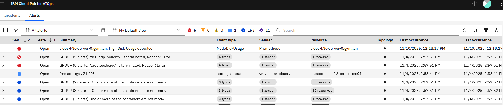
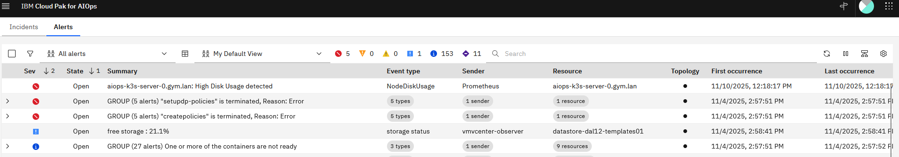
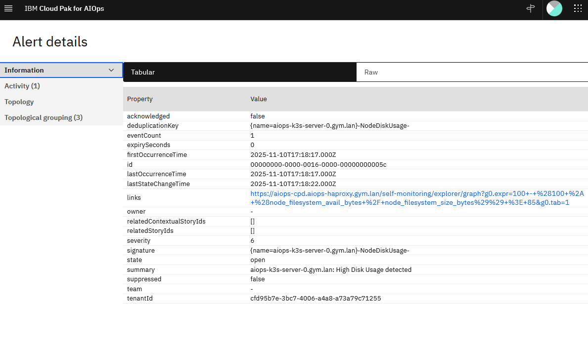
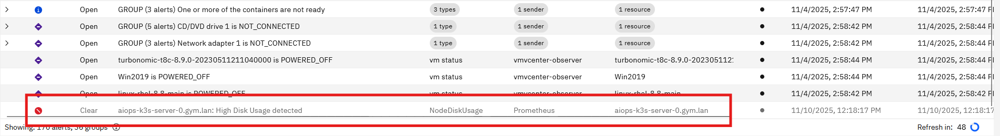

# Configuring LDAPS Trust in AIOps

To enable a secure connection (LDAPS) between AIOps and an external LDAP server, you must import the LDAP server's Certificate Authority (CA) certificate into the platform's truststore.

## Architecture Patterns

Before applying the configuration, it is important to understand *why* this certificate is needed. There are two common patterns for integrating LDAP with AIOps using SAML.

### Option 1: The "Broker" Approach
In this model, the IdP handles all LDAP communication. AIOps learns about user and group data through SAML login attempts.

*   **Certificate Requirement:** The LDAP CA is in the IdP connection to LDAP, not AIOps.
*   **AIOps Config:** No LDAP connection required in AIOps.

```{mermaid}
flowchart TD
    User((User))
    AIOps["AIOps Platform"]
    IdP["IdP"]
    LDAP[("LDAP Server")]

    subgraph "Authorization Flow"
    User -->|"(1) Access UI"| AIOps
    AIOps -.->|"(2) Redirect for Auth"| IdP
    IdP <-->|"(3) Verify Creds and Fetch Groups"| LDAP
    IdP == "(4) SAML Token (User + Groups)" ==> AIOps
    end

    style AIOps fill:#14164a,stroke:#333,stroke-width:2px
    style LDAP fill:#eee,stroke:#333,stroke-width:2px
    
    linkStyle 3 stroke-width:4px,fill:none,stroke:green;
```

| Pros | Cons |
| :--- | :--- |
| **Simpler Config:** AIOps needs no knowledge of LDAP topology. | **Role Management:** AIOps must first wait to be told about a group from a failed SAML login, then that group can be assigned a role. |
| **Single Trust Store:** Only the IdP needs the LDAP certificates. | |

***

### Option 2: The "Direct Dependency" Approach
In this model, AIOps uses SAML for authentication but connects directly to LDAP to search for user groups and details. **The instructions in this document apply to this scenario.**

*   **Certificate Requirement:** You must import the LDAP CA into **AIOps**.
*   **AIOps Config:** Requires an LDAP connection profile in AIOps.

```{mermaid}
flowchart TD
    User((User))
    AIOps["AIOps Platform"]
    IdP["IdP"]
    LDAP[("LDAP Server")]

    subgraph "Authorization Flow"
    User -->|"(1) Access UI"| AIOps
    AIOps -.->|"(2) Redirect for Auth"| IdP
    IdP <-->|"(3) Verify Creds Only"| LDAP
    IdP == "(4) SAML Token (User Only)" ==> AIOps
    AIOps <-->|"(5) Direct Query: Get User Groups"| LDAP
    end

    style AIOps fill:#f9f,stroke:#333,stroke-width:2px
    style LDAP fill:#eee,stroke:#333,stroke-width:2px
    
    linkStyle 3 stroke-width:4px,fill:none,stroke:green;
    linkStyle 4 stroke-width:4px,fill:none,stroke:red;
```

| Pros | Cons |
| :--- | :--- |
| **Role Management:** You can manage all the roles of LDAP users and groups inside the AIOps console immediately. | **Complexity:** Requires configuring LDAP in two places (IdP and AIOps). |
| | **Network:** AIOps requires direct firewall access to the LDAP server. |

---

## Prerequisites

*   **Access:** `kubectl` access to the cluster.
*   **Certificate:** The CA certificate file (e.g., `ca.crt`) that signed your LDAP server's certificate.
    *   *Note:* This must be the **Root CA** of the LDAP server, not an ingress certificate or a client certificate.

## Procedure

### 1. Encode the Certificate

The certificate must be converted to a single-line Base64 string to be stored in a Kubernetes Secret.

Run the following command on your infrastructure node (Linux):

```bash
# Replace 'ca.crt' with your actual filename
cat ca.crt | base64 -w 0
```

::: {.callout-tip}
Mac Users: If you are running this on macOS, use cat ca.crt | base64 (omit the -w 0).
:::

Copy the output string to your clipboard. It will look like a long random string (e.g., `LS0tLS1CRUdJTi...`).

### 2. Edit the AIOps Trust Secret

AIOps uses a specific secret named platform-auth-ldaps-ca-cert to store trusted LDAP certificates.

1.  Open the secret for editing:

    ```bash
    kubectl edit secret platform-auth-ldaps-ca-cert -n aiops
    ```

2.  Locate the `data` section.
3.  Find the key named `certificate`.
    *   *If the key exists:* Replace the existing value.
    *   *If the key is empty/missing:* Add `certificate: ` followed by your string.

    It should look like this:

    ```yaml
    apiVersion: v1
    data:
      certificate: <PASTE_YOUR_BASE64_STRING_HERE>
    kind: Secret
    metadata:
      name: platform-auth-ldaps-ca-cert
      namespace: aiops
    type: Opaque
    ```

4.  Save and exit the editor (usually `Esc` then `:wq` if using vi).

### 3. Restart the Authentication Service

The authentication pods do not automatically reload the secret. You must restart them to pick up the new certificate.

```bash
kubectl delete pod -l component=platform-auth-service -n aiops
```

Wait for the pods to come back up to the `Running` state:

```bash
kubectl get pods -l component=platform-auth-service -n aiops -w
```

### 4. Verify Connectivity

Once the pods are running, you can test the connection via the AIOps Console or by checking the logs.

To check the logs for successful connection attempts:

```bash
kubectl logs -n aiops -l app=platform-identity-provider -f
```

### Troubleshooting Common Errors

| Log Error | Probable Cause |
|-----------|----------------|
| `ETIMEDOUT` | **Firewall / Network:** The pod cannot reach the LDAP IP on port 636. |
| `Handshake failed` | **Certificate:** The CA cert in the secret is wrong or expired. |
| `PKIX path building failed` | **Trust:** The server provided a cert that the secret's CA does not sign. |

---

# Configuring AIOps with Keycloak SAML

## Overview

This documentation outlines the configuration of SAML authentication for **IBM Cloud Pak for AIOps on Linux (k3s)** using **Keycloak** as the Identity Provider (IdP). This setup does not use LDAP; users are managed directly within Keycloak and authorized via Groups in AIOps.

### Prerequisites

*   **AIOps Platform**: IBM Cloud Pak for AIOps running on Linux (k3s environment).
*   **Keycloak**: Version 26.4.7 or later installed.
*   **Credentials**:
    *   Keycloak Default Admin: `admin` / `admin`
    *   AIOps Administrator: `cpadmin`

---

## Keycloak Initial Configuration

### Login and Realm Creation

1.  Log in to the **Keycloak Admin Console** using the default credentials (`admin` / `admin`).
2.  Open the **Manage realms** menu on the top-left sidebar.
3.  Click the **Create realm** button.
4.  Enter the **Realm name**: `AIOpsRealm`.
5.  Click **Create**.

::: {.callout-note}
### Why create a new Realm?
We create a dedicated realm rather than using `Master` to isolate the AIOps application data. A realm manages a set of users, credentials, roles, and groups. Using a separate realm ensures that application-specific configurations do not impact the administrative `Master` realm.
:::

### Create a Sample User

1.  Ensure you are in the `AIOpsRealm`.
2.  Click **Users** in the left menu.
3.  Click **Create new user**.
4.  Fill in the details:
    *   **Username**: `aiops-test-user`
    *   **Email**: `aiops-test@example.com`
    *   **First Name**: `AIOps`
    *   **Last Name**: `Tester`
    *   **Email Verified**: Toggle to **Yes**.
5.  Click **Create**.
6.  Click the **Credentials** tab at the top of the user profile.
7.  Click **Set Password**.
8.  Enter a password (e.g., `Password123!`), toggle **Temporary** to **Off**, and click **Save**.

### Create a Group

1.  Click the **Groups** menu on the left sidebar.
2.  Click **Create group**.
3.  Enter the name: `aiops-analysts`.
4.  Click **Create**.
5.  Navigate back to **Users** (left menu) and select `aiops-test-user`.
6.  Click the **Groups** tab.
7.  Click **Join Group**, select `aiops-analysts`, and click **Join**.

---

## SAML Configuration Handshake

Configuring SAML requires a specific "handshake": starting in AIOps to get the Service Provider metadata, moving to Keycloak to create the client, and finishing in AIOps with the IdP metadata.

### Step 1: Start AIOps Configuration (Download SP Metadata)

1.  Log in to the **AIOps Console** as `cpadmin`.
2.  Navigate to **Administration** > **Access Control**.
3.  Click **Identity Providers**.
4.  Click **New Connection** > **SAML 2.0**.
5.  Enter the **Connection Name**: `KeycloakSAML`.
6.  **Stop here.** Do not close this window.
7.  Locate the section titled **To identity provider**.
8.  Click the **Download metadata** button.
9.  This saves a file named `metadata.xml`. Keep this file accessible.

### Step 2: Configure Keycloak Client (Import SP Metadata)

1.  Return to the **Keycloak Admin Console** (`AIOpsRealm`).
2.  Click **Clients** in the left menu.
3.  Click **Import client**.
4.  Click **Browse** and select the `metadata.xml` file you downloaded from AIOps.
5.  Keycloak will parse the file.
    *   **Client type**: Ensure this is `SAML`.
    *   **Client ID**: This will be a long URL (e.g., `https://<host>/idauth/ibm/saml20/defaultSP`). **Do not change this**; it must match the Entity ID expected by AIOps.
    *   **Name**: This will be blank. Enter `AIOps` to make it easier to find in the list later.
6.  Click **Save**.

### Step 3: Configure Client Settings (NameID)

AIOps maps `Sub` (Subject) to `nameID` by default. You do not need a mapper for this, but you must tell Keycloak to send the Username as the Subject in the standard SAML header.

1.  In the **Client details** screen (Settings tab) for the new `AIOps` client:
2.  Scroll down to the **SAML capabilities** or **Signature and Encryption** section.
3.  Ensure **Sign documents** is toggled **On**.
4.  Scroll to the **Login settings** (or Advanced settings depending on Keycloak version).
5.  Find **Name ID Format**. Set this to `username`.
    *   *Note: This ensures that the `<Subject>` field in the SAML assertion contains the `aiops-test-user` username, which AIOps will map to `Sub`.*
6.  Toggle **Force Name ID Format** to **On**.
7.  Click **Save**.

### Step 4: Configure Token Mappers in Keycloak

AIOps expects specific attribute names by default (`firstName`, `lastName`, `emailAddress`, `blueGroups`). We must map Keycloak values to these exact names.

1.  Click the **Client scopes** tab within the `AIOps` client details.
2.  Click the `*-dedicated` scope (e.g., `...-dedicated`).
3.  **Add the Mappers:**

    *   **First Name**:
        *   Click **Configure a new mapper** (or **Add mapper** > **By configuration**).
        *   Select **User Property**.
        *   **Name**: `givenName mapping`
        *   **Property**: `firstName`
        *   **SAML Attribute Name**: `firstName`
        *   Click **Save**.

    *   **Last Name**:
        *   Click **Add mapper** > **By configuration** > **User Property**.
        *   **Name**: `familyName mapping`
        *   **Property**: `lastName`
        *   **SAML Attribute Name**: `lastName`
        *   Click **Save**.

    *   **Email**:
        *   Click **Add mapper** > **By configuration** > **User Property**.
        *   **Name**: `email mapping`
        *   **Property**: `email`
        *   **SAML Attribute Name**: `emailAddress`
        *   Click **Save**.

    *   **Groups**:
        *   Click **Add mapper** > **By configuration** > **Group list**.
        *   **Name**: `group mapping`
        *   **SAML Attribute Name**: `blueGroups`
        *   **Full group path**: **Off** (To send `aiops-analysts` instead of `/aiops-analysts`).
        *   Click **Save**.

### Step 5: Export Keycloak IdP Metadata

1.  In Keycloak, go to **Realm Settings** (left menu).
2.  Under the **General** tab, scroll down to the **Endpoints** (or SAML Metadata) section.
3.  Click **SAML 2.0 Identity Provider Metadata**.
4.  This will open the XML in a new browser tab. **Save this page** as `keycloak-idp-metadata.xml`.

### Step 6: Finish AIOps Configuration (Upload IdP Metadata)

1.  Return to the **AIOps Console** wizard (where you left off in Step 1).
2.  Scroll to the section titled **From identity provider**.
3.  Upload the `keycloak-idp-metadata.xml` file you just saved.
4.  Review the **Token attribute mapping** section. It should display the defaults:
    *   **Sub**: `nameID` (Matches the "Name ID Format: username" setting in Keycloak).
    *   **Given Name**: `firstName` (Matches our mapper).
    *   **Family name**: `lastName` (Matches our mapper).
    *   **Groups**: `blueGroups` (Matches our mapper).
    *   **Email**: `emailAddress` (Matches our mapper).
5.  Click **Create** (or **Save**).

---

## Configuring Group Access (API Workaround)

Because the Foundational Services layer on k3s does not always automatically populate SAML groups in the UI, we must manually create a User Group using the internal API and map the Keycloak group to it.

Perform the following steps on your Linux terminal where you have `kubectl` access to the cluster.

### 1. Set Environment Variables

Define the Ingress hosts for your environment. Ensure these URLs are resolvable from your terminal.

```bash
# Example hosts - update these to match your specific k3s ingress routes
export ZENHOST=https://aiops-cpd.aiops-haproxy.gym.lan
export CPHOST=https://cp-console-aiops.aiops-haproxy.gym.lan
```

### 2. Retrieve Credentials and Generate Tokens

We need to retrieve the cpadmin password from the Kubernetes secret and use it to generate two tokens: an IAM token and a Zen token.

```bash
# Get credentials using kubectl
export USERNAME=`kubectl get secret platform-auth-idp-credentials -o json | jq -r .data.admin_username| base64 -d`
export PASSWORD=`kubectl get secret platform-auth-idp-credentials -o json | jq -r .data.admin_password| base64 -d`

# Generate IAM Token
IAM_TOKEN=$(curl -k -X POST -H "Content-Type: application/x-www-form-urlencoded;charset=UTF-8" -d "grant_type=password&username=${USERNAME}&password=${PASSWORD}&scope=openid" "${CPHOST}/idprovider/v1/auth/identitytoken" 2> /dev/null | jq -r ".access_token")

# Generate Zen Token
ZENTOKEN=$(curl -k -X GET "${ZENHOST}/v1/preauth/validateAuth" --header "username: ${USERNAME}" --header "iam-token: ${IAM_TOKEN}" 2> /dev/null | jq -r '.accessToken')
```

### 3. Identify the Desired Role

AIOps has specific internal role IDs. Run this command to see the available roles and their IDs.

```bash
curl -k -H "Authorization: Bearer $ZENTOKEN" -X GET $ZENHOST/usermgmt/v1/roles | jq -r '.rows[] | [ .doc.role_name, .doc._id ] | @csv ' | sed -e 's/,/|/g' -e 's/\"//g'
```

*Common Output:*

```text
Automation Analyst|iaf-automation-analyst
Automation Developer|iaf-automation-developer
User|zen_user_role
Administrator|zen_administrator_role
Automation Administrator|iaf-automation-admin
```

For this guide, we will use `iaf-automation-analyst` to give our group Analyst permissions.

### 4. Create the Internal Group

We will create a group inside AIOps named "**AIOps Analysts**" and assign it the **Automation Analyst** role.

```bash
# Create the group and capture the output to find the new ID
curl -k -s -X POST "${ZENHOST}/usermgmt/v2/groups" \
  --header 'Content-Type: application/json' \
  --header 'Accept: application/json' \
  --header "Authorization: Bearer ${ZENTOKEN}" \
  -d '{"name": "AIOps Analysts", "description": "Mapped SAML Group", "role_identifiers": ["iaf-automation-analyst"]}' | jq .
```

**Note the `id` in the output.** (Example: `10001`).

### 5. Map the Keycloak Group to the Internal Group

Finally, we map the string `aiops-analysts` (which Keycloak sends in the `blueGroups` attribute) to the internal group ID we just created (e.g., `10001`).

*Replace `10001` in the URL below with the actual ID returned in the previous step.*

```bash
curl -k -s -X POST "${ZENHOST}/usermgmt/v2/groups/10001/members" \
  --header 'Content-Type: application/json' \
  --header 'Accept: application/json' \
  --header "Authorization: Bearer ${ZENTOKEN}" \
  -d '{"idp_groups": ["aiops-analysts"]}'
```

---

## Verification

Now that the group mapping is established via the API, the user should have immediate access upon login.

1. Open a **Private/Incognito** browser window.
2. Navigate to the AIOps Console URL.
3. Select **Enterprise SAML** (or `KeycloakSAML`) from the login screen.
4. Redirect to Keycloak -> Log in as `aiops-test-user`.
5. **Success**: You should be redirected back to the AIOps console and successfully logged in. The user will have the permissions defined by the **Automation Analyst** role.

---

# Self Monitoring

---

## Setting Up a Promethues AlertManager Webhook in AIOps

### 1. Define the Webhook in the AIOps UI
1. Navigate to **Integrations** in the AIOps console and select **Add integration**.
2. Under the **Events** category, select **Prometheus AlertManager**, click **Get started**.
3. Provide a **Name** (e.g. *Prometheus*) and optional **description** for the webhook to identify its purpose (e.g., *Prometheus Alerts (Self Monitoring)*).
4. Select **None** for **Authentication type** and click **Next**.

---

### 2. Map Prometheus Alert JSON to AIOps Schema
1. In the webhook configuration screen, locate the **Mapping** section.
2. Use the following JSONata mapping:

```json
(
    /* Set resource based on labels available */
    $resource := function($labels){(
      $name := $labels.name ? $labels.name
        : $labels.node_name ? $labels.node_name
        : $labels.statefulset ? $labels.statefulset
        : $labels.deployment ? $labels.deployment
        : $labels.daemonset ? $labels.daemonset
        : $labels.pod ? $labels.pod
        : $labels.container ? $labels.container
        : $labels.instance ? $labels.instance
        : $labels.app ? $labels.app
        : $labels.job_name ? $labels.job_name
        : $labels.job ? $labels.job
        : $labels.type ? $labels.type: $labels.prometheus;

      /* Conditional Namespace Append */
      $namespace_appended := $labels.namespace ? ($name & '/' & $labels.namespace) : $name;

      /* Check if the determined $name is likely a node/hardware name */
      $is_node_alert := $labels.node_name or $labels.instance;

      $is_node_alert ? $name : $namespace_appended; /* Only append if NOT a node alert */
    )};    
    /* Map to event schema */
    alerts.(
      { 
        "summary": annotations.summary ? annotations.summary: annotations.description ? annotations.description : annotations.message ? annotations.message,
        "severity": $lowercase(labels.severity) = "critical" ? 6 : $lowercase(labels.severity) = "major" ? 5 : $lowercase(labels.severity) = "minor" ? 4 : $lowercase(labels.severity) = "warning" ? 3 : 1, 
        "resource": {
          "name": $resource(labels)
        },
        "type": {
          "eventType": $lowercase(status) = "firing" ? "problem": "resolution",
          "classification": labels.alertname
        },
        "links": [
          {
              "url": generatorURL
          }
        ],
        "sender": {
          "name": "Prometheus",
          "type": "Webhook Connector"
        },
       "details": labels
      }
    )
  )
```
3. Click **Save**.

---

### 3. Generate the Webhook and Capture the URL
1. The webhook will start initializing, wait as it intializes.
2. A unique **Webhook route** will be displayed (e.g., `https://<aiops-domain>/webhook-connector/<id>`) once the webhook is **Running**.
3. Copy this URL — it will be used in the **AlertmanagerConfig** in Prometheus to send alerts to AIOps.

---

## Prometheus Alertmanager: Webhook Receiver Configuration for AIOps

This section outlines the steps required to configure the **Prometheus Operator's Alertmanager** to successfully send alerts to the AIOps webhook endpoint.

The process involves two main phases:

- **Network Configuration**: Ensuring the webhook FQDN is resolvable within the cluster.
- **Alerting Configuration**: Defining the Alertmanager receiver and routing.

---

### 1. Network Configuration (DNS Resolution)

The Alertmanager pod must be able to resolve the AIOps webhook FQDN (e.g. `whconn-d59baea5-a620-4efd-bfdc-bbbce5314530-aiops.aiops-haproxy.gym.lan`). Since this FQDN is custom and resolves to a specific HAProxy IP (`192.168.252.9`), the entry must be added to **CoreDNS**.

#### Update the `coredns-custom` ConfigMap

Edit the `coredns-custom` ConfigMap in the `kube-system` namespace to include the webhook domain, mapping it to your HAProxy IP (`192.168.252.9`). This approach is necessary since standard Kubernetes DNS does not resolve external domains.

**Note**: Replace `192.168.252.9` with your actual HAProxy IP if different. Replace `<webhook route>` with the fqdn from the webhook route generated by AIOps (e.g. `whconn-d59baea5-a620-4efd-bfdc-bbbce5314530-aiops.aiops-haproxy.gym.lan`)

**Additional Note**: The below ConfigMap also contains additional DNS mapping to the CloudPak console and the AIOPs UI. This may or may not be applicable to your environment.

```bash
kubectl apply -f - <<EOF
apiVersion: v1
kind: ConfigMap
metadata:
  name: coredns-custom
  namespace: kube-system
apiVersion: v1
data:
  default.server: |
    cp-console-aiops.aiops-haproxy.gym.lan {
        hosts {
              192.168.252.9 cp-console-aiops.aiops-haproxy.gym.lan
              fallthrough
        }
    }
    aiops-cpd.aiops-haproxy.gym.lan {
        hosts {
              192.168.252.9 aiops-cpd.aiops-haproxy.gym.lan
              fallthrough
        }
    }
    <webhook route> {
        hosts {
              192.168.252.9 <webhook route>
              fallthrough
        }
    }
EOF
```

#### Restart CoreDNS

Force CoreDNS to reload the new ConfigMap by restarting the deployment:

```bash
kubectl -n kube-system rollout restart deployment coredns
```

---

After CoreDNS restarts, the Alertmanager will be able to resolve the hostname, and all firing alerts will successfully flow to your AIOps webhook.

---

### 2. Configure Alertmanager Receiver

Since the Prometheus Operator uses the **AlertmanagerConfig Custom Resource (CRD)**, we define the webhook receiver and routing within this resource.

#### Define the AlertmanagerConfig CR

Create or update the `AlertmanagerConfig` CR (named `aiops-webhook-receiver` in this example) to include the receiver and routing.

Replace the sample webhook route `https://whconn-d59baea5-a620-4efd-bfdc-bbbce5314530-aiops.aiops-haproxy.gym.lan/webhook-connector/fj3u0bq23tk` with 
your actual webhook route and save to a file named `aiops-alertmanagerconfig.yaml`.

```yaml
apiVersion: monitoring.coreos.com/v1alpha1
kind: AlertmanagerConfig
metadata:
  name: aiops-webhook-receiver
  namespace: prometheus-operator # Must be in the same namespace as Alertmanager
  labels:
    alertmanagerConfig: main # Must match your Alertmanager CR selector
spec:
  # 1. Define the Receiver
  receivers:
  - name: 'aiops-webhook-receiver'
    webhookConfigs:
      - url: 'https://whconn-d59baea5-a620-4efd-bfdc-bbbce5314530-aiops.aiops-haproxy.gym.lan/webhook-connector/fj3u0bq23tk' # REPLACE
        sendResolved: true
        # Required for self-signed certificates
        httpConfig:
          tlsConfig:
            insecureSkipVerify: true
          
  # 2. Define the Route
  route:
    receiver: 'aiops-webhook-receiver' # Route all alerts to the new receiver
    groupBy: ['alertname', 'severity'] 
    groupWait: 30s
    groupInterval: 5m
    repeatInterval: 4h
```

#### Apply the Configuration

Apply the manifest:

```bash
kubectl apply -f aiops-alertmanagerconfig.yaml
```

---

### 3. Alert Lifecycle

This section assumes that you have created a rule in Prometheus to trigger an alert if an AIOps node root filesystem `/` usage exceeds 90%.

#### Trigger Storage Alert

Use the following script `trigger_disk_alert.sh` to trigger a storage alert on the root fileystem of an AIOps node.

```bash
#!/bin/bash

# Configuration
TARGET_PERCENT=90
MOUNT_POINT="/"
SAFETY_BUFFER_MB=10 # Add 10MB buffer to ensure we pass the threshold
TARGET_FILE="/tmp/ROOT_FILL_FILE.bin"

echo "--- Disk Usage Alert Trigger ---"

# 1. Get disk statistics for the root filesystem in Kilobytes (KB)
# Uses df -k to get output in KB for precise calculation
if ! STATS=$(df -k "${MOUNT_POINT}" 2>/dev/null | awk 'NR==2{print $2, $3}'); then
    echo "Error: Failed to get disk statistics for ${MOUNT_POINT}. Exiting."
    exit 1
fi

TOTAL_KB=$(echo "$STATS" | awk '{print $1}')
USED_KB=$(echo "$STATS" | awk '{print $2}')
# AVAILABLE_KB is not strictly needed for the calculation, but useful for debugging

# Calculate percentages using integer arithmetic (multiplying by 100 first for precision)
CURRENT_PERCENT=$(( (USED_KB * 100) / TOTAL_KB ))

# Convert KB to MB for display purposes only
TOTAL_MB=$(( TOTAL_KB / 1024 ))
USED_MB=$(( USED_KB / 1024 ))

echo "Filesystem: ${MOUNT_POINT}"
echo "Total Size: ${TOTAL_MB} MB"
echo "Used Size:  ${USED_MB} MB (${CURRENT_PERCENT}%)"
echo "Target:     ${TARGET_PERCENT}% usage"

# 2. Check if the disk is already above the target
# Integer check: If (Current Used KB * 100) is >= (Total KB * Target Percent)
if [ $(( USED_KB * 100 )) -ge $(( TOTAL_KB * TARGET_PERCENT )) ]; then
    echo "Current usage (${CURRENT_PERCENT}%) is already above the target (${TARGET_PERCENT}%). No file created."
    exit 0
fi

# 3. Calculate the required KB to reach the target percentage
# T_target_KB = (TOTAL_KB * TARGET_PERCENT) / 100
TARGET_USAGE_KB=$(( (TOTAL_KB * TARGET_PERCENT) / 100 ))

# Calculate buffer size in KB
SAFETY_BUFFER_KB=$(( SAFETY_BUFFER_MB * 1024 ))

# Required KB = (Target KB - Current Used KB) + Safety Buffer KB
REQUIRED_KB=$(( TARGET_USAGE_KB - USED_KB + SAFETY_BUFFER_KB ))


# 4. Convert required KB to MB (dd count uses 1MB blocks) and round up
# Use shell arithmetic for simple rounding up: (KB + 1023) / 1024
REQUIRED_MB_COUNT=$(( (REQUIRED_KB + 1023) / 1024 ))

# 5. Execute dd command
echo "--------------------------------------"
echo "Creating file of size: ${REQUIRED_MB_COUNT} MB at ${TARGET_FILE}"
echo "This will push usage over ${TARGET_PERCENT}%..."

# Execute the dd command using the calculated count
# Note: Requires sudo access to write to the filesystem
sudo dd if=/dev/zero of="${TARGET_FILE}" bs=1M count="${REQUIRED_MB_COUNT}" 2>/dev/null

# 6. Final verification (Use awk to extract the percentage from df -h)
NEW_PERCENT=$(df -h "${MOUNT_POINT}" | awk 'NR==2{print $5}')
echo "Creation complete."
echo "New usage: ${NEW_PERCENT}"
echo "--------------------------------------"

exit 0
```

Run the script.

```bash
chmod +x trigger_disk_alert.sh && ./trigger_disk_alert.sh
```

Sample output.

```
--- Disk Usage Alert Trigger ---
Filesystem: /
Total Size: 2916 MB
Used Size:  2041 MB (69%)
Target:     90% usage
--------------------------------------
Creating file of size: 594 MB at /tmp/ROOT_FILL_FILE.bin
This will push usage over 90%...
Creation complete.
New usage: 91%
--------------------------------------
```

#### Alert in Prometheus

Log in to Prometheus Explorer Alerts console with your AIOps credentials. The URL is `https://aiops-cpd.<domain>/self-monitoring/explorer/alerts` where `<domain>` is the
network domain AIOps is installed on (e.g. [https://aiops-cpd.aiops-haproxy.gym.lan/self-monitoring/explorer/alerts]((https://aiops-cpd.aiops-haproxy.gym.lan/self-monitoring/explorer/alerts))).

Within a few minutes you will see a `NodeDiskUsage` alert firing.



#### Alert in AIOps

In AIOps, navigate to the Alerts list. Here you will see the critical Prometheus alert for High Disk Usage.



Double click on the alert to open the details.



#### Resolve Alert

On the same not where you triggered the disk usage script. Resolve the disk consumption by deleting the created file.

```bash
sudo rm -f /tmp/ROOT_FILL_FILE.bin
```

After a few minutes, Prometheus will clear the alert and the clear action will cascade to AIOps.


